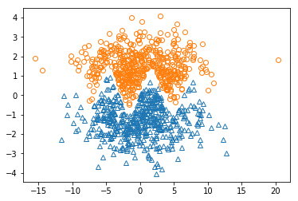

First of all, we need to implement the SVM solver based on the SMO algorithm.


```python
import numpy as np
import matplotlib.pyplot as plt
import os
```
We define some auxilary functions. The following two functions are related with the kernel function and kernel matrix

```python
""" kernel part for SVM """
def kernel_func(x1,x2, kernel_type=None):
	if kernel_type is None:
		return np.dot( x1,x2)
	elif kernel_type["name"]=="GAUSSIAN":
		sigma = kernel_type["params"][0]
		return np.exp(- np.dot( x1-x2, x1-x2 )/(2*sigma**2)  )


def get_kernel_matrix( x1, x2, kernel_type=None ):
	num_samples_x1 = x1.shape[0]
	num_samples_x2 = x2.shape[0]
	kernel_matrix = np.zeros([num_samples_x1, num_samples_x2])
	for nrow in range(num_samples_x1 ):
		for ncol in range(num_samples_x2  ):
			kernel_matrix[nrow][ncol] = kernel_func(x1[nrow] , x2[ncol], kernel_type = kernel_type)
	return kernel_matrix
```

Then we need to implement the SVM solver part, which is encapsulated into a class


```python
"""
Description: A SVM solver
Input:  training dataset (x,y), together with other hype-parameters
Return: a trained SVM model (solver) which is able to perform classification for a give x
"""
import numpy as np

""" kernel part for SVM """
def kernel_func(x1,x2, kernel_type=None):
	if kernel_type is None:
		return np.dot( x1,x2)
	elif kernel_type["name"]=="GAUSSIAN":
		sigma = kernel_type["params"][0]
		return np.exp(- np.dot( x1-x2, x1-x2 )/(2*sigma**2)  )


def get_kernel_matrix( x1, x2, kernel_type=None ):
	num_samples_x1 = x1.shape[0]
	num_samples_x2 = x2.shape[0]
	kernel_matrix = np.zeros([num_samples_x1, num_samples_x2])
	for nrow in range(num_samples_x1 ):
		for ncol in range(num_samples_x2  ):
			kernel_matrix[nrow][ncol] = kernel_func(x1[nrow] , x2[ncol], kernel_type = kernel_type)
	return kernel_matrix


class SVM_Solver:
	def __init__(self, kernel_type=None , C=10):

		self.support_ind = None
		self.support_x = None
		self.support_y = None
		self.support_lamb = None
		self.kernel_type= kernel_type
		self.C = C
		self.count = 0
		self.objective_func = -np.Inf
		self.lamb = None
		self.param_b = None

	## This is a SVM trained predictor
	def predict(self,x, decision_mode = "hard"):
		def decision_func(z):
			if decision_mode == "soft":
				if z<-1:
					return -1
				elif z>1:
					return 1
				else:
					return z
			elif decision_mode == "hard":
				if z<0:
					return -1
				else:
					return 1
		K = get_kernel_matrix(self.support_x, x, kernel_type = self.kernel_type )
		pred_y = []
		for ind in range(x.shape[0]):
			z= np.dot( self.support_lamb* self.support_y, K[:,ind] ) +  self.param_b  
			pred_y.append(decision_func(z))	
		return np.array(pred_y)
		
		"""Training the SVM model, which uses x, y and validation set x_val, y_val
        max_iter is the maximum iteration to train;
        epsilon is use to determine when the training is terminated -- the change of objective
        function is less than epsilon
        """
	def train( self, x, y, x_val, y_val, max_iter= 1E6, epsilon= 1E-4 ):
	
		num_samples = x.shape[0]
		"""Solve the dual problem using SMO"""
		## Initialization
		K=get_kernel_matrix(x,x, kernel_type = self.kernel_type )	
		C = self.C
		if self.lamb is None:
			self.lamb = np.zeros(num_samples)
		if self.param_b is None:
			self.param_b = np.random.normal()
		## Start looping:
		## looping parameters:

		local_count =0
		##Here is the part of the SMO algorithm
		while True:
			## randomly select a pair (a,b) to optimize
			[a,b] = np.random.choice( num_samples, 2, replace= False )
			if K[a,a] + K[b,b] - 2*K[a,b] ==0:
				continue	

			lamb_a_old = self.lamb[a]
			lamb_b_old = self.lamb[b]	

			Ea =  np.dot(self.lamb * y, K[:,a]) + self.param_b - y[a]
			Eb =  np.dot(self.lamb * y, K[:,b]) + self.param_b - y[b]	

			lamb_a_new_unclip = lamb_a_old  + y[a] *(Eb-Ea)/( K[a,a] + K[b,b] - 2*K[a,b] )
			xi = - lamb_a_old  * y[a] - lamb_b_old * y[b]	

			if y[a] != y[b]:
				L = max( xi * y[b], 0 )
				H = min( C+xi*y[b], C )
			else:
				L = max( 0, -C-xi*y[b])
				H = min( C, -xi*y[b] )	

			if lamb_a_new_unclip < L:
				lamb_a_new = L
			elif lamb_a_new_unclip > H:
				lamb_a_new = H
			else:
				lamb_a_new = lamb_a_new_unclip	

			lamb_b_new = lamb_b_old + ( lamb_a_old - lamb_a_new )*y[a] * y[b]
			if lamb_a_new >0 and lamb_a_new <C:
				self.param_b =  self.param_b - Ea + ( lamb_a_old- lamb_a_new)*y[a]*K[a,a] + (lamb_b_old - lamb_b_new)*y[b] * K[b,a]
			elif lamb_b_new >0 and lamb_b_new <C:
				self.param_b = self.param_b - Eb + ( lamb_a_old- lamb_a_new)*y[a]*K[a,b] + (lamb_b_old - lamb_b_new)*y[b] * K[b,b]	

			self.lamb[a] = lamb_a_new
			self.lamb[b] = lamb_b_new	

			self.count +=1
			local_count +=1

			"""Every 5000 iterations record the current progree of the training,
            and determine whether to stop the training.
            """
			if local_count >= max_iter or self.count % 5000 ==0:
				## get the support set
				self.support_ind =  self.lamb > 0
				self.support_x = x[self.support_ind]
				self.support_y = y[self.support_ind]
				self.support_lamb = self.lamb[self.support_ind]	
	
				## Evaluate the performance (accuracy) on training set and validation set
				pred_y=self.predict(x)
				train_acc =  np.sum( pred_y == y)/ y.shape[0]
				pred_y=self.predict(x_val)
				val_acc =  np.sum( pred_y == y_val  )/ y_val.shape[0]

				support_K = K[ self.support_ind,: ][:, self.support_ind]
				new_objective_func = np.sum( self.support_lamb ) - 0.5 * np.dot( np.matmul( ( self.support_lamb *self.support_y ).T, support_K ).T , self.support_lamb* self.support_y  ) 

				## support ratio represents the percentage of the points which are support vectors
				support_ratio = np.sum( self.support_ind )/ self.support_ind.shape[0] 

				print("Iteration: %d, \tTrain accuracy: %.2f%%, \tVal accuracy: %.2f%%, \tDelta Objective Function: %f, \tSupport Ratio: %.2f%%"%(self.count, train_acc*100, val_acc*100, new_objective_func - self.objective_func, support_ratio *100 ))
				
				## If the change of dual objective function is less than epsilon, then stop training
				if abs( new_objective_func - self.objective_func ) <= epsilon:
					break
				else:
					self.objective_func = new_objective_func
				
				if local_count >= max_iter:
					break
```

Define some auxilary functions for compute the distance matrix, which is used to estimate the sigma for Gaussian Kernel, generator folder and plot the results.


```python
def distance_matrix( x,y, metric = "Euclidean" ):
	def distance( a,b ):
		if metric == "Euclidean":
			return np.linalg.norm(a-b)
	n_row = x.shape[0]
	n_col = y.shape[0]
	dis_matrix = np.zeros([n_row, n_col] )
	for r in range( n_row ):
		for c in range(n_col ):
			dis_matrix[r][c] = distance( x[r], y[c])
	return dis_matrix


def generate_folder(path):
	if not os.path.exists(path):
		os.makedirs(path)

	return path

# This plot results is used to plot the results on training dataset, e.g, what the separating hyperplane looks
# like, how the support vectors are distributed, and whether the points are correctly classified
def plot_results( x,y, support_ind, pred_y, title = "", img_save_path = None , show_img = True ):

	fig, ax = plt.subplots()

    ## Possibly used if the data dimension is larger than 2
	# x_low_dim, P = PCA(x, 2, return_projection_matrix = True)
	x_low_dim = x

	x_support =  x[support_ind]
	y_support = y[support_ind]
	pred_y_support = pred_y[support_ind]
	x_support_low_dim = x_low_dim[support_ind]


	for ind in range(x.shape[0]):
		if y[ind] == 1:
			mshape = "^"
		else:
			mshape = "o"
		if pred_y[ind] == 1:
			color = "r"
		else:
			color = "b"

		plt.plot(x_low_dim[ind,0], x_low_dim[ind,1], mshape, c= color, markerfacecolor='none', markeredgewidth=0.4, markersize =4)

	for ind in range(x_support.shape[0]):
		if y_support[ind] == 1:
			mshape = "^"
		else:
			mshape = "o"
		if pred_y_support[ind] == 1:
			color = "r"
		else:
			color = "b"

		plt.plot(x_support_low_dim[ind,0], x_support_low_dim[ind,1], mshape, c= color, markersize =4)

	for ind in range(x.shape[0]):
		if y[ind]!= pred_y[ind]:
			plt.plot(x_low_dim[ind,0], x_low_dim[ind,1], "o", c= "g", markersize =9, markerfacecolor='none')

	plt.xlabel("x")
	plt.ylabel("y")
	plt.xlim([min(x_low_dim[:,0])-0.5, max(x_low_dim[:,0])+0.5 ])
	plt.ylim([min(x_low_dim[:,1])-0.5, max(x_low_dim[:,1])+0.5 ])

	plt.title(title)
	if img_save_path is not None:
		plt.savefig( img_save_path )
	if show_img:
		plt.show()

	plt.close()
```

## Test the kernel SVM on linearly non-separable data

First we load the data


```python
def load_data(num_samples = 1000):
	x1 = []
	x2 = []
	for _ in range(num_samples):
		while True:
			r_x = np.random.multivariate_normal( [0,1], [[20,0],[0,1]], 1 )
			if r_x[0,1]>np.sin( r_x[0,0] )+0.5:
				x1.append( r_x )
				break
		while True:
			r_x = np.random.multivariate_normal( [0,-1], [[20,0],[0,1]], 1 )
			if r_x[0,1]<np.sin( r_x[0,0] ):
				x2.append( r_x )
				break


	x1 = np.concatenate( x1, axis =0 )
	x2 = np.concatenate( x2, axis =0)
	y1 = np.ones([num_samples]) *-1
	y2 = np.ones([num_samples]) *1
	x = np.concatenate([x1,x2], axis =0)
	y = np.concatenate([y1,y2], axis =0)

	return x, y
```

What does this loaded data look like? Let's load and plot it.


```python
x,y = load_data(500)
x_pos = x[y==1]
x_neg = x[y==-1]
plt.plot( x_pos[:,0], x_pos[:,1], "^", markerfacecolor='none' )
plt.plot( x_neg[:,0], x_neg[:,1], "o", markerfacecolor='none' )
plt.show()
```





```python


x,y = load_data(500)
x_val, y_val = load_data(100)

estimated_sigma = np.mean( distance_matrix( x,x ) ) * 0.5
print(estimated_sigma)

svm= SVM_Solver( kernel_type = {"name":"GAUSSIAN", "params":[estimated_sigma] } )

epoch =0
while True:
	svm.train(x,y, x_val, y_val, max_iter = 100000)
	epoch +=1
	plot_results( x,y, svm.support_ind, pred_y= svm.predict(x), title = "", img_save_path = generate_folder("results/test_kernel_func/")+"epoch%d.png"%(epoch) , show_img = False )

	if epoch >=20:
		break
```
